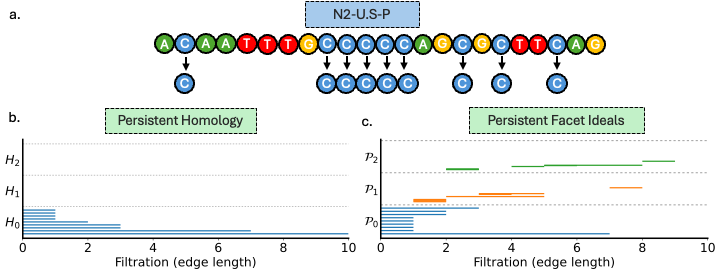

# CAP

**Title** - CAP: Commutative Algebra Prediction of Protein-Nucleic Acid Binding Affinities.

**Authors** - Mushal Zia, Faisal Suwayyid, Yuta Hozumi, JunJie Wee, Hongsong Feng, and Guo-Wei Wei.

---

## Table of Contents

- [Table of Contents](#table-of-contents)
- [Introduction](#introduction)
- [Model Interpretability](#model-Interpretability)
- [Prerequisites](#prerequisites)
- [Datasets](#datasets)
- [Modeling with PSRT-based features](#Modeling-with-PSRT-based-features)
    - [Generation of PSRT-based features for protein-nucleic acid complex](#II-Generation-of-PSRT-based-features-for-protein-ligand-complex)

- [Results](#results)
- [License](#license)
- [Citation](#citation)

---

## Introduction

An accurate prediction of protein-nucleic acid binding affinity is vital for deciphering genomic processes, yet existing approaches often struggle in reconciling high accuracy with interpretability and computational efficiency. In this study, we introduce commutative algebra prediction (CAP), which couples persistent Stanley-Reisner theory with advanced sequence embedding  for predicting protein-nucleic acid binding affinities. CAP encodes proteins through transformer-learned embeddings that retain long-range evolutionary context and represents DNA and RNA with $\textit{k}$-mer algebra embeddings derived from persistent facet ideals, which capture fine-scale nucleotide geometry. We demonstrate that CAP surpasses the SVSBI protein-nucleic acid benchmark and, in a further test, maintains reasonable performance on newly curated protein-RNA (S142) and protein-nucleic acid (S322) datasets. Leveraging only primary sequences, CAP generalizes to any protein-nucleic acid pair with minimal preprocessing, enabling genome-scale analyses without 3D structural data and promising faster virtual screening for drug discovery and protein engineering.

> **Keywords**: Persistent commutative algebra, facet persistence barcodes, persistent ideals, commutative algebra learning, protein-nucleic acid binding.

---

## Model Interpretability

An illustration of the comparison between Persistent Homology and Persistent Stanley-Reisner
Invariant on the N2-U.S-P primer sequence is shown below.



---

## Prerequisites

- numpy                     1.21.0
- scipy                     1.7.3
- pytorch                   1.10.0 
- pytorch-cuda              11.7
- torchvision               0.11.1
- scikit-learn              1.0.2
- python                    3.10.12
- biopandas                 0.4.1
--- 

## Datasets

Sequence-based representations of proteins and DNA/RNA, along with their corresponding binding affinity labels, are provided in this repository.

Datasets used in this study:

| Dataset | Type                 | Number of Complexes | Download                     |
|---------|----------------------|---------------------|------------------------------|
| S186    | Protein–Nucleic Acid | 186                 | [data](./Datasets/S186.csv) |
| S142    | Protein–RNA          | 142                 | [data](./Datasets/S142.csv) |
| S322    | Protein–DNA          | 322                 | [data](./Datasets/S322.csv) |

---

## Modeling with PSRT-based features using CAP pipeline

### I. Build machine learning models using PSRT-based DNA/RNA features using the sequence only.

#### 1. Create output folder for point clouds
```shell
mkdir -p 1HVO_pointclouds_k1
```
#### 2. Generate 1-mer k-mer point clouds from the FASTA file
```shell
python DNA_feature_extraction.py clouds . 1HVO_pointclouds_k1 --k 1
```
#### 3. Extract facet-curve and rate features
```shell
python DNA_feature_extraction.py features 1HVO_pointclouds_k1 1HVO_k1_facet.csv \
    --k 1 --max-dim 2 --num-samples 50
```
### II. Generation of sequence-based ESM2 features for proteins
Protein sequence embeddings were generated with [Transformer Protein language model ESM2](https://github.com/facebookresearch/esm) [Rives2021].


## Results

### I. Modeling the Protein–Nucleic Acid Datasets

| Dataset | Training Set | Test Set | PCC  | RMSE (kcal/mol) |  
|---------|--------------|----------|------|------------------|  
| S186 [result](./Results/S186_predictions.csv) | – | 186 | 0.705 | 1.79 |  
| S142 [result](./Results/S142_predictions.csv) | – | 142 | 0.653 | 2.18 |  
| S322 [result](./Results/S322_predictions.csv) | – | 322 | 0.669 | 2.00 |

> Note: Predictions were made using Gradient Boosting Regressor Tree (GBRT) models trained on sequence-based features extracted from protein and nucleic acid sequences. Each dataset was evaluated using independently trained models under 20 random initializations. The predictions for all three datasets can be found in the [results](./Results) folder.

---

## Citation
- [Rives2021] Rives, Alexander, Joshua Meier, Tom Sercu, Siddharth Goyal, Zeming Lin, Jason Liu, Demi Guo et al. "Biological structure and function emerge from scaling unsupervised learning to 250 million protein sequences." Proceedings of the National Academy of Sciences 118, no. 15 (2021): e2016239118.
---
